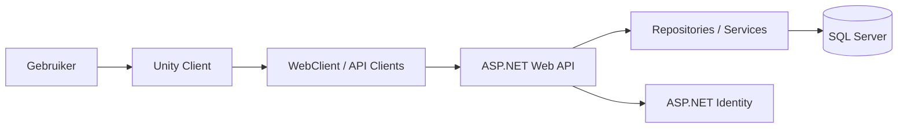
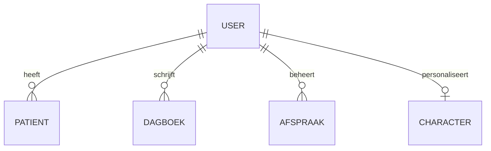

# Software-ontwerp ZorgApp 1.3

## Inleiding
Voor dit project heb ik gewerkt met twee gekoppelde applicaties:
- `avansbitbybit/zorgapp1.3`: de Unity-app/game
- `avansbitbybit/zorgapp1.3webapi`: de .NET Web API

Samen vormen deze applicaties één systeem. De Unity-app is de frontend waarin de gebruiker inlogt, navigeert door de app, een avatar aanpast en gegevens zoals afspraken en dagboekitems bekijkt of beheert. De Web API verwerkt de data, regelt authenticatie en slaat alles op in de database.

Het doel van dit software-ontwerp is om duidelijk te maken hoe de applicatie technisch is opgebouwd, welke componenten er zijn, hoe die met elkaar samenwerken en welke ontwerpkeuzes zijn gemaakt.

---

## Architectuur
De applicatie gebruikt een **client-serverarchitectuur**.

- De **client** is de Unity-app.
- De **server** is de ASP.NET Web API.
- De **database** is SQL Server.

Daarnaast gebruikt de backend een **gelaagde architectuur** met controllers, services, repositories en modellen.

### Overzicht

### Uitleg
De gebruiker bedient de Unity-app. Vanuit de Unity-scripts worden API-calls gedaan naar de Web API. De Web API verwerkt deze requests, controleert of de gebruiker is ingelogd en haalt daarna gegevens op uit de database of schrijft gegevens weg.

---

## Frontendontwerp: Unity-app
De Unity-app bestaat uit verschillende scènes en scripts.

### Belangrijke onderdelen
- **LoginScript / RegisterScript**: verwerken inloggen en registreren
- **MenuSceneManager**: navigatie tussen schermen
- **DagboekSceneManager**: ophalen, tonen en verwijderen van dagboekitems
- **AfspraakManager**: beheren van afspraken
- **Avatarcostumizer**: aanpassen en opslaan van avatarinstellingen
- **PollSceneManager / VideoSceneManager**: scene-specifieke functies

### API-koppeling in Unity
De Unity-app gebruikt een centrale `WebClient` voor HTTP-requests. Daarnaast zijn er gespecialiseerde API-clients, zoals:
- `UserApiClient`
- `PatientApiClient`
- `DagboekApiClient`
- `AfspraakApiClient`

Hierdoor hoeft niet elk script zelf HTTP-verkeer te regelen. Dat maakt de code overzichtelijker.

### Lokale opslag
De Unity-app gebruikt `PlayerPrefs` voor:
- het opslaan van het access token;
- avatarinstellingen;
- lokale gebruikersvoorkeuren.

Dat is een simpele en praktische oplossing voor dit project, maar minder geschikt voor productieomgevingen vanwege de beperkte beveiliging.

---

## Backendontwerp: .NET Web API
De backend is opgebouwd in lagen.

### Belangrijke componenten
- **Controllers**
  - `PatientController`
  - `DagboekController`
  - `AfspraakController`
  - `CharacterController`
- **Services**
  - `CharacterService`
  - `AspNetIdentityAuthenticationService`
- **Repositories**
  - `PatientRepository`
  - `DagboekRepository`
  - `AfspraakRepository`
  - `CharacterRepository`
- **Modellen**
  - `PatientModel`
  - `DagboekModel`
  - `AfspraakModel`
  - `Character`

### Werking van de backend
De controllers ontvangen requests van de Unity-client. Vervolgens roepen ze services of repositories aan. Repositories gebruiken Dapper om SQL-queries uit te voeren op de database.

### Waarom deze opbouw logisch is
Deze structuur zorgt voor scheiding van verantwoordelijkheden:
- controllers regelen HTTP-verkeer;
- services bevatten logica;
- repositories regelen databasecommunicatie.

Dat maakt de applicatie beter onderhoudbaar dan wanneer alles in één laag zou staan.

---

## Authenticatie en autorisatie
Voor authenticatie is gekozen voor **ASP.NET Identity**.

De gebruiker kan registreren en inloggen via de `/account`-endpoints. Na inloggen krijgt de Unity-app een token terug. Dat token wordt opgeslagen en meegestuurd bij volgende requests.

De backend gebruikt daarna de ingelogde gebruiker om data te filteren op `UserId`. Daardoor ziet iedere gebruiker alleen zijn of haar eigen gegevens.

Dit is een belangrijke ontwerpkeuze, omdat privacy en afscherming van gegevens in een zorgapplicatie extra belangrijk zijn.

---

## Datamodel
De belangrijkste gegevens in het systeem zijn:
- **Gebruiker**
- **Patiënt**
- **Dagboekitem**
- **Afspraak**
- **Character/avatar**

### Relaties

Vrijwel alle functionele data is gekoppeld aan een `UserId`. Hierdoor blijft data logisch gescheiden per gebruiker.

---

## Belangrijkste interacties

### 1. Inloggen
1. Gebruiker vult e-mail en wachtwoord in.
2. `LoginScript` roept `UserApiClient` aan.
3. `UserApiClient` verstuurt een request via `WebClient` naar `/account/login`.
4. De backend controleert de gebruiker met ASP.NET Identity.
5. De Unity-app ontvangt een token en slaat dat op.

### 2. Dagboek ophalen
1. `DagboekSceneManager` vraagt via `WebClient` de dagboekitems op.
2. De Web API controleert de gebruiker.
3. `DagboekRepository` haalt de data uit SQL Server.
4. De JSON-response wordt in Unity ingeladen en op knoppen/schermen getoond.

### 3. Afspraak toevoegen
1. De gebruiker vult een afspraak in.
2. Unity verstuurt een POST-request naar `/Afspraak`.
3. De backend valideert de invoer.
4. De backend controleert businessregels, bijvoorbeeld max. aantal afspraken.
5. De afspraak wordt opgeslagen in SQL Server.

---

## Ontwerpkeuzes en motivatie

### 1. Client-serverarchitectuur
Deze keuze is logisch omdat de Unity-app en de data-opslag gescheiden blijven. De frontend hoeft de database niet direct te kennen.

### 2. Dapper in de backend
Dapper is lichtgewicht en snel. Het past goed bij eenvoudige CRUD-operaties en geeft veel controle over SQL-query’s.

### 3. Unity als frontend
Unity past goed bij een interactieve, visuele applicatie met spelelementen en avatarfunctionaliteit.

### 4. Identity voor gebruikersbeheer
ASP.NET Identity is een sterke keuze omdat het authenticatie en beveiliging grotendeels standaard oplost.

---

## Sterke punten van het huidige ontwerp
- duidelijke scheiding tussen frontend en backend;
- backend gebruikt lagen en dependency injection;
- gebruikersdata wordt afgeschermd via `UserId`;
- centrale `WebClient` voorkomt veel dubbele code;
- architectuur is goed genoeg om de applicatie daadwerkelijk te realiseren.

---

## Verbeterpunten
Tijdens het analyseren van de code vielen ook een paar verbeterpunten op:

- de servicelaag is nog niet overal consequent toegepast;
- sommige businessregels staan nog direct in controllers;
- er lijken kleine inconsistenties te zijn tussen frontend en backend, bijvoorbeeld in verwachte endpoints;
- `PlayerPrefs` is niet de veiligste opslag voor tokens;
- bij handgeschreven SQL kunnen makkelijk kleine fouten ontstaan.

Deze punten maken de architectuur niet onbruikbaar, maar laten wel zien waar de applicatie verder verbeterd kan worden.

---

## Verbeteringen richting hogere kwaliteit
Om de applicatie sterker te maken op schaalbaarheid, onderhoudbaarheid en performance, zou ik de volgende verbeteringen adviseren:
- meer logica verplaatsen naar services;
- API-contracten strakker definiëren;
- validatie centraliseren;
- veiliger tokenbeheer invoeren;
- frontend-scripts verder opdelen in kleinere herbruikbare componenten;
- bulkacties slimmer afhandelen om onnodige API-calls te verminderen.

---

## Conclusie
De ZorgApp 1.3 is opgebouwd volgens een duidelijke client-serverarchitectuur. De Unity-app verzorgt de gebruikersinterface en communicatie met de backend. De .NET Web API verwerkt authenticatie, autorisatie en databeheer via repositories en SQL Server.

Het ontwerp bevat de belangrijkste componenten en interacties die nodig zijn om de applicatie te realiseren. Daarnaast zijn er duidelijke architectuurkeuzes gemaakt, zoals het gebruik van ASP.NET Identity, Dapper en een centrale `WebClient`. Hoewel er nog verbeterpunten zijn, vormt de huidige architectuur een goede basis voor een werkende en uitbreidbare applicatie.
