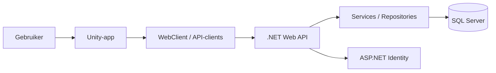
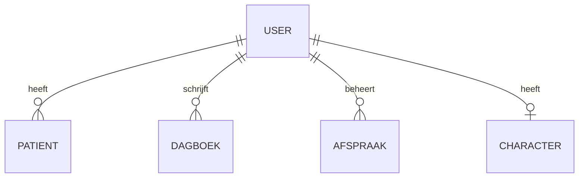

# Software-ontwerp ZorgApp 1.3

## Inleiding
Voor dit project heb ik twee gekoppelde applicaties gebouwd: een Unity-applicatie (`zorgapp1.3`) en een .NET Web API (`zorgapp1.3webapi`). De bedoeling van dit ontwerp is om duidelijk te laten zien hoe deze onderdelen samenwerken, welke componenten er zijn en waarom voor deze structuur is gekozen.

De Unity-app is het deel waar de gebruiker mee werkt. Daarin kan de gebruiker onder andere inloggen, door verschillende scènes navigeren, een avatar aanpassen en gegevens zoals afspraken en dagboekitems beheren. De Web API verwerkt deze gegevens op de achtergrond en slaat ze op in de database.

---

## Algemene architectuur
Voor deze applicatie is gekozen voor een **client-serverarchitectuur**. Dat betekent dat de Unity-app als client werkt en de Web API als server. De client vraagt gegevens op of stuurt gegevens door, en de server verwerkt dat en communiceert met de database.

Daarnaast is de backend opgezet volgens een **gelaagde architectuur**. De backend bestaat namelijk uit controllers, services, repositories en modellen. Hierdoor zijn de verantwoordelijkheden verdeeld en blijft de code overzichtelijker.

### Architectuuroverzicht

Deze opbouw maakt het mogelijk om de frontend en backend los van elkaar te ontwikkelen en te onderhouden.

---

## Frontendontwerp
De frontend is gebouwd in Unity. Binnen Unity wordt gewerkt met scènes en scripts. Elke scène heeft zijn eigen verantwoordelijkheden, bijvoorbeeld voor login, menu’s, afspraken of dagboekfunctionaliteit.

### Belangrijke onderdelen van de frontend
- `LoginScript`: verwerkt het inloggen van de gebruiker
- `RegisterScript`: verwerkt het registreren van een nieuwe gebruiker
- `MenuSceneManager`: verzorgt navigatie tussen scènes
- `DagboekSceneManager`: beheert het ophalen en tonen van dagboekitems
- `AfspraakManager`: beheert afspraken
- `Avatarcostumizer`: laat de gebruiker een avatar aanpassen en opslaan
- `PollSceneManager` en `VideoSceneManager`: regelen andere scene-specifieke functies

### API-communicatie
In de Unity-app is gekozen voor een centrale `WebClient`. Deze klasse verzorgt:
- het versturen van GET-, POST-, PUT- en DELETE-requests;
- het toevoegen van de token aan requests;
- het verwerken van responses en fouten.

Daarnaast zijn er losse API-clients per domein, zoals:
- `UserApiClient`
- `PatientApiClient`
- `DagboekApiClient`
- `AfspraakApiClient`

Dit is een goede ontwerpkeuze, omdat HTTP-communicatie hierdoor niet verspreid staat door alle scripts heen.

### Lokale opslag
Voor lokale opslag wordt `PlayerPrefs` gebruikt. Daarmee worden onder andere tokens en avatarinstellingen opgeslagen. Voor een schoolproject is dat handig en snel te implementeren. Voor een professionele productieomgeving zou dit minder veilig zijn.

---

## Backendontwerp
De backend is gebouwd als een ASP.NET Web API. Hier is duidelijk gekozen voor een scheiding in lagen.

### Onderdelen van de backend
**Controllers**
- `PatientController`
- `DagboekController`
- `AfspraakController`
- `CharacterController`

**Services**
- `CharacterService`
- `AspNetIdentityAuthenticationService`

**Repositories**
- `PatientRepository`
- `DagboekRepository`
- `AfspraakRepository`
- `CharacterRepository`

**Modellen**
- `PatientModel`
- `DagboekModel`
- `AfspraakModel`
- `Character`

### Verdeling van verantwoordelijkheden
- **Controllers** behandelen HTTP-requests en responses.
- **Services** bevatten logica die niet direct in controllers hoort.
- **Repositories** voeren databasequery’s uit.
- **Modellen** beschrijven de data die wordt opgeslagen of uitgewisseld.

Deze opbouw is onderhoudbaar, omdat wijzigingen in bijvoorbeeld de database niet direct overal in de applicatie aangepast hoeven te worden.

---

## Authenticatie en beveiliging
Voor de authenticatie is gekozen voor **ASP.NET Identity**. Dat is een logische keuze, omdat gebruikersbeheer, registratie en inloggen dan via een beproefde oplossing lopen.

Wanneer een gebruiker inlogt, ontvangt de Unity-app een token. Dat token wordt daarna meegestuurd bij volgende API-calls. In de backend wordt de ingelogde gebruiker bepaald via de `AspNetIdentityAuthenticationService`. Daarna wordt data gekoppeld of gefilterd op basis van `UserId`.

Dit is belangrijk, omdat gebruikers alleen hun eigen gegevens mogen zien. Zeker in een zorgapplicatie is dat een belangrijk onderdeel van het ontwerp.

---

## Data en database
De backend werkt met SQL Server en gebruikt **Dapper** voor databasecommunicatie.

De belangrijkste entiteiten in het systeem zijn:
- gebruiker
- patiënt
- dagboekitem
- afspraak
- character/avatar

### Relaties tussen entiteiten

Elke gebruiker heeft dus zijn of haar eigen gegevens. Deze koppeling gebeurt via `UserId`.

### Waarom Dapper?
Er is gekozen voor Dapper omdat het lichtgewicht is en directe controle over SQL biedt. Voor een project met vrij eenvoudige CRUD-functionaliteit is dat prima bruikbaar. Het nadeel is wel dat je zelf goed moet opletten bij het schrijven van query’s, omdat kleine fouten niet automatisch worden opgevangen.

---

## Belangrijkste interacties
### Inloggen
Bij het inloggen voert de gebruiker gegevens in binnen de Unity-app. Het `LoginScript` roept daarna `UserApiClient` aan. Die stuurt via `WebClient` een request naar de Web API. De API controleert de gegevens via ASP.NET Identity en geeft een token terug. Dat token wordt in Unity opgeslagen.

### Dagboek ophalen
Wanneer de dagboekscène opent, roept `DagboekSceneManager` een request naar `/Dagboek` aan. De backend controleert welke gebruiker is ingelogd en haalt alleen de dagboekitems van die gebruiker op. Daarna worden deze items in Unity getoond.

### Afspraak toevoegen
Bij het toevoegen van een afspraak maakt Unity een POST-request naar `/Afspraak`. De backend controleert of de gebruiker is ingelogd, of de invoer geldig is en of bepaalde businessregels niet worden overtreden, zoals een maximum aantal afspraken. Daarna wordt de afspraak opgeslagen.

---

## Ontwerpkeuzes
### 1. Client-serverarchitectuur
Deze keuze zorgt ervoor dat de interface en de data-opslag los van elkaar staan. Dat maakt het systeem beter onderhoudbaar.

### 2. Gelaagde backend
Door controllers, services en repositories te scheiden, blijft de backend overzichtelijk en beter uitbreidbaar.

### 3. Centrale WebClient in Unity
Deze keuze voorkomt dubbele code en maakt netwerkcommunicatie consistenter.

### 4. ASP.NET Identity voor gebruikersbeheer
Hierdoor hoeft authenticatie niet helemaal zelf gebouwd te worden en is de beveiliging beter geregeld.

### 5. Dapper voor data-access
Dapper is efficiënt en direct, maar vraagt wel meer discipline bij query’s.

---

## Sterke punten van het ontwerp
- duidelijke scheiding tussen frontend en backend;
- backend gebruikt dependency injection en lagen;
- data is gekoppeld aan gebruikersaccounts;
- frontend heeft een centrale manier van API-communicatie;
- de architectuur is duidelijk genoeg om de applicatie te bouwen en uit te breiden.

---

## Verbeterpunten
Tijdens het analyseren van de code kwamen ook een aantal verbeterpunten naar voren:
- niet alle logica zit netjes in services; een deel staat nog in controllers;
- sommige verwachte frontend-functionaliteit lijkt niet helemaal overeen te komen met de backend;
- tokenopslag via `PlayerPrefs` is niet ideaal voor security;
- handgeschreven SQL is foutgevoeliger;
- sommige onderdelen van de startup-configuratie in de backend kunnen netter en consistenter.

---

## Verbeteringen voor de toekomst
Als deze applicatie verder ontwikkeld zou worden, zou ik de volgende verbeteringen adviseren:
- meer logica naar services verplaatsen;
- API-contracten strakker afstemmen;
- centrale validatie invoeren;
- veiliger opslag van tokens gebruiken;
- frontend-scripts verder opdelen om ze beter onderhoudbaar te maken;
- mogelijk logging en foutafhandeling verder professionaliseren.

---

## Conclusie
De ZorgApp 1.3 is technisch opgebouwd uit een Unity-frontend en een .NET Web API-backend. Samen vormen ze een systeem dat volgens een client-serverarchitectuur werkt. De backend maakt gebruik van een gelaagde opbouw met controllers, services, repositories en modellen. De frontend gebruikt scènes, scripts, API-clients en een centrale `WebClient`.

Ik vind deze architectuur passend voor dit project, omdat de belangrijkste verantwoordelijkheden goed gescheiden zijn en de applicatie hierdoor voldoende duidelijk is opgebouwd. Tegelijkertijd zijn er nog verbeterpunten die vooral te maken hebben met consistentie, security en verdere modularisatie. Ondanks die verbeterpunten is het ontwerp sterk genoeg om de applicatie te realiseren en verder uit te bouwen.
