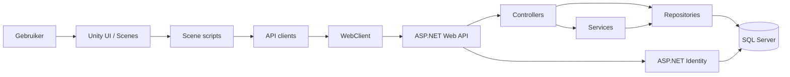
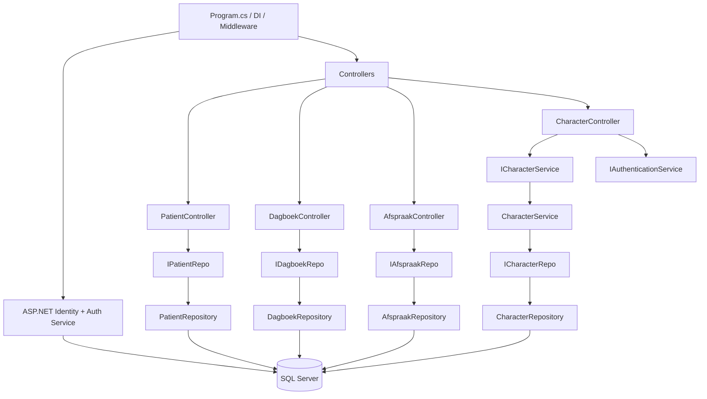
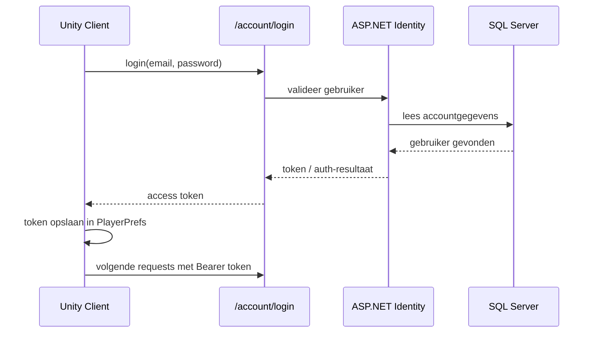
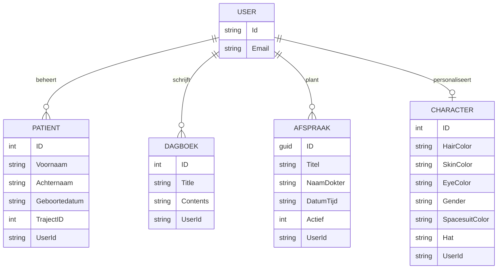
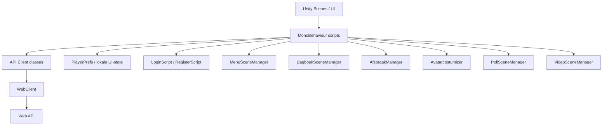
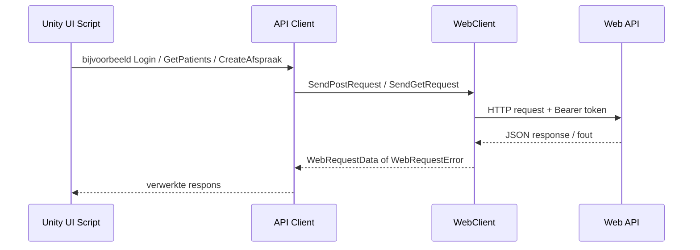
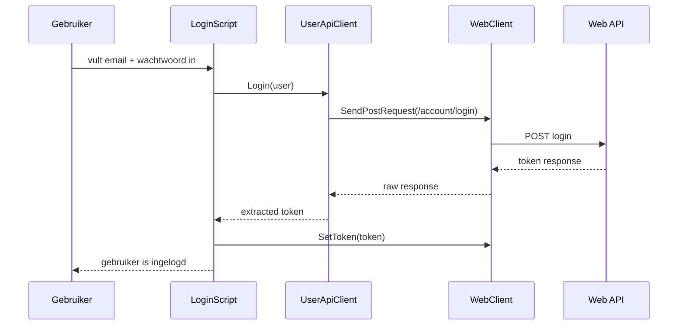
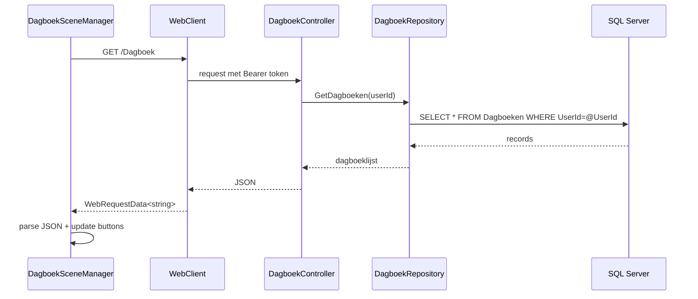
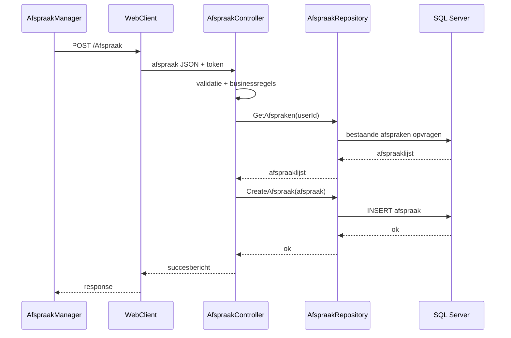
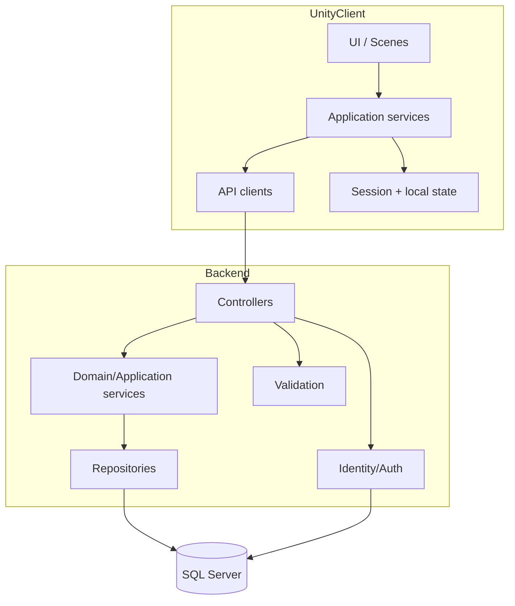

# Software-ontwerp ZorgApp 1.3

**Projecten**
- **Frontend/game:** `avansbitbybit/zorgapp1.3` (Unity)
- **Backend/API:** `avansbitbybit/zorgapp1.3webapi` (.NET Web API)

**Versie document:** 1.0  
**Datum:** 2026-03-23  
**Doel:** ontwerpdocumentatie voor beoordeling en realisatie van de applicatie

---

## 1. Inleiding

ZorgApp 1.3 bestaat uit twee samenwerkende onderdelen:
1. een **Unity-applicatie** waarin de gebruiker door scènes navigeert, inlogt, een avatar personaliseert en gegevens zoals afspraken en dagboekitems bekijkt of beheert;
2. een **ASP.NET Web API** die authenticatie, autorisatie en data-opslag verzorgt.

De applicatie volgt in de huidige vorm in grote lijnen een **client-serverarchitectuur**. De Unity-client is verantwoordelijk voor presentatie en gebruikersinteractie, terwijl de Web API verantwoordelijk is voor authenticatie, businessregels en persistente opslag in SQL Server via Dapper.

Dit document beschrijft:
- de huidige architectuur;
- de belangrijkste componenten en hun interacties;
- de toegepaste architectuurprincipes;
- belangrijke ontwerpkeuzes;
- knelpunten in het huidige ontwerp;
- verbetervoorstellen voor schaalbaarheid, onderhoudbaarheid en performance.

---

## 2. Doel van het systeem

De applicatie ondersteunt een zorggerichte gebruikerservaring waarin een gebruiker kan:
- registreren en inloggen;
- patiëntgegevens beheren;
- dagboekitems bekijken, toevoegen, wijzigen en verwijderen;
- afspraken beheren;
- een character/avatar aanmaken of aanpassen;
- door scènes navigeren zoals menu, video, poll en missies.

De backend zorgt ervoor dat deze gegevens per gebruiker worden afgeschermd via identity-based authenticatie.

---

## 3. Architectuurprincipe

### 3.1 Gekozen principe
De oplossing is hoofdzakelijk gebaseerd op een combinatie van:
- **Client-serverarchitectuur**
- **Gelaagde architectuur** in de backend
- **Separation of concerns** tussen UI, communicatie, domeinmodellen en data-opslag

### 3.2 Toepassing

#### Frontend (Unity)
De Unity-app is opgebouwd uit:
- **Scene/UI-laag**: MonoBehaviours voor knoppen, schermen en navigatie
- **API-clientlaag**: classes zoals `UserApiClient`, `PatientApiClient`, `DagboekApiClient`, `AfspraakApiClient`
- **Transportlaag**: `WebClient` voor HTTP-requests, tokenbeheer en foutafhandeling
- **Modellaag**: client-side datastructuren zoals `Patient`, `Dagboek`, `Afspraak`, `User`

#### Backend (.NET Web API)
De Web API gebruikt een gelaagde opbouw:
- **Controllerlaag**: REST-endpoints
- **Servicelaag**: logica die niet direct in controllers hoort
- **Repositorylaag**: databasecommunicatie via Dapper
- **Modellaag**: datamodellen voor opslag en API-uitwisseling
- **Authenticatielaag**: ASP.NET Identity + custom authentication service

Deze scheiding maakt de applicatie begrijpelijker, beter testbaar en makkelijker uitbreidbaar dan wanneer alle logica direct in controllers of Unity-scripts zou staan.

---

## 4. Overzicht van de totale architectuur



### Uitleg
- De gebruiker werkt in de Unity-interface.
- Unity-scripts reageren op invoer en roepen API-clients aan.
- `WebClient` verstuurt HTTP-verzoeken inclusief Bearer-token.
- De Web API controleert authenticatie en routeert verzoeken naar controllers.
- Controllers gebruiken repositories en services.
- Repositories lezen en schrijven gegevens in SQL Server.
- ASP.NET Identity beheert accounts en authenticatiegerelateerde gegevens.

---

## 5. Componentontwerp backend (.NET Web API)

## 5.1 Backend-hoofdstructuur



## 5.2 Program.cs en application bootstrap

De backend start in `Program.cs` en configureert daar:
- controllers;
- OpenAPI/Swagger;
- dependency injection;
- ASP.NET Identity API endpoints;
- Dapper stores;
- repositories en services;
- authorization;
- databaseverbinding via `IDbConnection`.

### Belangrijke ontwerpkeuze
De keuze voor **Dependency Injection** is goed, omdat daarmee controllers niet zelf hun dependencies aanmaken. Hierdoor zijn componenten beter vervangbaar en testbaar.

### Waargenomen aandachtspunten
- `IAfspraakRepository` wordt dubbel geregistreerd.
- `app.MapControllers()` wordt twee keer aangeroepen.
- `UseAuthorization()` staat relatief laat in de pipeline.

Dit zijn geen fundamentele architectuurfouten, maar wel tekenen dat de startup-configuratie opgeschoond moet worden.

---

## 5.3 Authenticatie en autorisatie

### Huidige oplossing
De backend gebruikt:
- `AddIdentityApiEndpoints<IdentityUser>()`
- rollen via `IdentityRole`
- Dapper stores voor identity data
- een eigen `AspNetIdentityAuthenticationService` die de huidige `UserId` ophaalt via `HttpContext`



### Ontwerpkwaliteit
Sterke punten:
- elke controller haalt de huidige gebruiker op;
- data wordt per gebruiker gefilterd;
- endpoints zijn bedoeld om alleen voor geauthenticeerde gebruikers te werken.

Verbeterpunten:
- er lijkt geen expliciete endpoint `/me` aanwezig, terwijl de Unity-client daar wel vanuit gaat;
- token parsing gebeurt client-side via handmatige extractie;
- de API gebruikt `RequireAuthorization()` én losse user checks; dat is veilig, maar dubbel.

### Conclusie
De architectuurkeuze is goed: **identity-based beveiliging aan serverzijde**. De implementatie mag consistenter.

---

## 5.4 Controllers

### Controllers in de Web API
- `PatientController`
- `DagboekController`
- `AfspraakController`
- `CharacterController`

### Verantwoordelijkheid van controllers
Controllers zijn verantwoordelijk voor:
- ontvangen van HTTP-requests;
- valideren van de authenticatiestatus;
- aanroepen van repository/service-methoden;
- teruggeven van HTTP-statuscodes.

### Beoordeling van de huidige controllerlaag
**Goed:**
- controllers zijn klein en redelijk overzichtelijk;
- verantwoordelijkheden zijn grotendeels duidelijk;
- fouten worden in delen van de code gelogd.

**Minder goed:**
- validatie is niet overal even uitgebreid;
- sommige businessregels staan in de controller in plaats van in services;
- foutafhandeling is niet overal uniform.

### Voorbeeld: AfspraakController
De `AfspraakController` bevat extra businessregels:
- verplichte velden;
- titel moet uniek zijn per gebruiker;
- maximaal 9 afspraken.

Dat zijn echte domeinregels. Architectonisch is het beter om die in een **service** onder te brengen, zodat:
- de controller dun blijft;
- de logica herbruikbaar is;
- unit testing makkelijker wordt.

---

## 5.5 Services

### Aanwezige services
- `AspNetIdentityAuthenticationService`
- `CharacterService`

### Functie
De services vormen de laag tussen controller en repository, vooral wanneer er logica nodig is die niet puur data-opslag is.

### Huidige observatie
De servicelaag wordt nog beperkt gebruikt. Alleen voor `Character` is er een expliciete service. Voor `Patient`, `Dagboek` en `Afspraak` gaat de controller rechtstreeks naar de repository.

### Ontwerpimplicatie
Voor een **voldoende** is dit bruikbaar. Voor een **goed/excellent** ontwerp is het beter om een consistente servicelaag te introduceren, bijvoorbeeld:
- `PatientService`
- `DagboekService`
- `AfspraakService`

Daar horen dan businessregels, validatie en transactielogica thuis.

---

## 5.6 Repositorylaag

### Repositories
- `PatientRepository`
- `DagboekRepository`
- `AfspraakRepository`
- `CharacterRepository`

### Gekozen technologie
De repositories gebruiken **Dapper** met ruwe SQL-query’s.

### Waarom dit logisch is
Dapper is geschikt wanneer:
- de data-access relatief eenvoudig is;
- performance belangrijk is;
- de ontwikkelaar controle wil over SQL;
- er minder overhead gewenst is dan bij een volledige ORM.

### Voorbeeld van het patroon
- Controller bepaalt welke actie nodig is
- Repository voert SQL uit
- Resultaten worden teruggegeven als modellen

### Pluspunten
- overzichtelijke query’s;
- laagdrempelig en snel;
- eenvoudige CRUD-operaties goed te volgen.

### Minpunten / risico’s
- validatie en domeinregels kunnen makkelijk versnipperen;
- SQL zit verspreid over de codebase;
- foutgevoelige query’s vallen pas laat op.

### Concrete technische observatie
In `DagboekRepository.UpdateDagboek` staat:
```sql
UPDATE Dagboeken SET Title = @Title, Contents = @Contents, WHERE ID = @ID AND UserId = @UserId
```
Hier staat een overbodige komma vóór `WHERE`, wat een SQL-fout veroorzaakt. Dat onderstreept waarom centrale testbaarheid en query-validatie belangrijk zijn.

---

## 5.7 Backend-datamodel

### Domeinobjecten
- `PatientModel`
- `DagboekModel`
- `AfspraakModel`
- `Character`
- Identity-tabellen voor gebruikersbeheer

### Conceptueel datamodel



### Ontwerpkeuze
Alle functionele data wordt gekoppeld aan `UserId`. Daardoor is gegevensscheiding per gebruiker een fundamenteel onderdeel van het ontwerp.

---

## 6. Componentontwerp frontend (Unity)

## 6.1 Frontend-hoofdstructuur



## 6.2 Belangrijkste frontend-componenten

### Authenticatie
- `LoginScript`
- `RegisterScript`
- `UserApiClient`
- `WebClient`

### Datafunctionaliteit
- `PatientApiClient`
- `DagboekApiClient`
- `AfspraakApiClient`
- scene managers voor laden, tonen, verwijderen en aanmaken

### UI / navigatie
- `MenuSceneManager`
- `SceneSwitcher`
- `PollSceneManager`
- `VideoSceneManager`

### Avatar / personalisatie
- `Avatarcostumizer`
- `Avatarloader`

---

## 6.3 Frontend-architectuur en patroon

De frontend volgt geen strikt MVVM of MVC, maar heeft wel een herkenbare pragmatische scheiding:
- **UI scripts** reageren op knoppen en scene-events;
- **API clients** vertalen acties naar backendcalls;
- **WebClient** verzorgt HTTP-transport en tokengebruik;
- **PlayerPrefs** bewaart beperkte lokale state.

### Beoordeling
Voor een studentproject is dit een verdedigbare keuze. Het is eenvoudig te begrijpen en relatief snel te implementeren.

Voor grotere schaalbaarheid zou een verdere scheiding wenselijk zijn:
- UI-presentatielaag
- application/service-laag in Unity
- data-accesslaag
- state management

---

## 6.4 WebClient als centrale integratielaag

`WebClient` is architectonisch een belangrijke component. Deze klasse verzorgt:
- opbouw van URLs vanuit `baseUrl`;
- toevoegen van `Authorization: Bearer <token>`;
- uitvoeren van GET/POST/PUT/DELETE;
- serialisatie van request body;
- foutafhandeling en responseverpakking;
- tokenopslag in `PlayerPrefs`.



### Waarom dit een goede keuze is
Door HTTP-verkeer te centraliseren in één component:
- wordt duplicatie verminderd;
- blijft de code consistenter;
- kan logging en foutafhandeling op één plek worden verbeterd.

### Risico’s
- `WebClient` combineert transport, tokenbeheer en foutverwerking in één klasse;
- als deze klasse groeit, wordt het een **god object**;
- `PlayerPrefs` is praktisch, maar niet de veiligste plek voor tokens.

---

## 6.5 API-clients

De API-clients vormen adapters tussen Unity-scripts en de backend:
- `UserApiClient`
- `PatientApiClient`
- `DagboekApiClient`
- `AfspraakApiClient`

### Functie
Elke client weet:
- welke route moet worden aangeroepen;
- welk model moet worden geserialiseerd;
- hoe een response teruggegeven moet worden.

### Voordeel
Deze aanpak voorkomt dat URL’s en requestlogica overal direct in scene scripts terechtkomen.

### Waarneming
De clients zijn nuttig, maar nog dun. In een verder doorontwikkeld ontwerp kunnen zij worden uitgebreid met:
- inputvalidatie;
- mapping van responses;
- retry-policy;
- onderscheid tussen technische en functionele fouten.

---

## 6.6 Lokale state en persistente clientdata

### Huidige opslag
De client gebruikt `PlayerPrefs` voor:
- access token;
- avatarinstellingen;
- naam van de avatar.

### Ontwerpkeuze
Dit is een lichte en eenvoudige manier om gebruikersdata lokaal te bewaren zonder extra complexiteit.

### Beoordeling
**Goed voor prototype/studentproject:**
- weinig configuratie;
- direct bruikbaar;
- werkt prima voor simpele instellingen.

**Beperking:**
- niet geschikt voor gevoelige data-opslag op productieniveau;
- geen versleuteling;
- beperkt beheer van sessies en expiratie.

---

## 7. Belangrijkste use cases en interacties

## 7.1 Inloggen



## 7.2 Dagboek ophalen en tonen



## 7.3 Afspraak toevoegen



---

## 8. Afhankelijkheden

## 8.1 Backend-afhankelijkheden
- **ASP.NET Core Web API**
- **ASP.NET Identity**
- **Dapper**
- **SQL Server** via `SqlConnection`
- **Swagger / OpenAPI**

## 8.2 Frontend-afhankelijkheden
- **Unity**
- **TextMeshPro**
- **UnityWebRequest**
- **JsonUtility** / helper classes
- visuele assets, scenes en prefabs

## 8.3 Operationele afhankelijkheden
- werkende API-base-url in Unity;
- beschikbare SQL Server database;
- juiste connection string in backendconfiguratie;
- consistente API-contracten tussen client en server.

---

## 9. Belangrijke ontwerpkeuzes en alternatieven

## 9.1 Dapper in plaats van Entity Framework
**Keuze:** Dapper voor directe SQL-toegang.  
**Voordelen:** snel, lichtgewicht, controle over query’s.  
**Nadelen:** minder abstrahering, meer handmatig werk, foutgevoeliger.  
**Alternatief:** Entity Framework Core voor migraties, validatie en sterkere mapping.

## 9.2 Unity als frontend
**Keuze:** Unity als interactieve client/game-omgeving.  
**Voordelen:** sterk voor visuele interactie, scènes, gamification en avatarfunctionaliteit.  
**Nadelen:** minder standaard voor klassieke zorgformulieren dan web/mobile apps.  
**Alternatief:** mobiele app of webfrontend voor meer traditionele UX.

## 9.3 Token in PlayerPrefs
**Keuze:** eenvoud en snelheid van implementatie.  
**Voordeel:** makkelijk te gebruiken.  
**Nadeel:** beperkt veilig.  
**Alternatief:** secure storage of platform-specifieke versleutelde opslag.

## 9.4 Repositories direct vanuit controllers
**Keuze:** pragmatisch en simpel.  
**Voordeel:** minder lagen, sneller te bouwen.  
**Nadeel:** businesslogica komt sneller in controllers terecht.  
**Alternatief:** consequent gebruik van services tussen controller en repository.

---

## 10. Kwaliteitsattributen

## 10.1 Onderhoudbaarheid
### Huidige situatie
Positief:
- duidelijke mappenstructuur;
- basis-scheiding in controllers, repositories, services en modellen;
- API-clients in Unity gescheiden van scene scripts.

Beperkingen:
- inconsistent gebruik van servicelaag;
- businessregels op meerdere plekken;
- API-contracten niet volledig gecentraliseerd;
- naming en taalgebruik zijn gemengd (Nederlands/Engels).

### Verbetering
- service-laag uitbreiden;
- DTO’s introduceren;
- centrale validatie gebruiken;
- gedeelde API-contracten documenteren.

## 10.2 Schaalbaarheid
### Huidige situatie
Voor een kleine gebruikersgroep is dit ontwerp voldoende.

### Beperkingen
- repositorylogica en businesslogica zijn nog niet optimaal losgekoppeld;
- client gebruikt relatief veel directe scene-specifieke logica;
- weinig caching of batching;
- waarschijnlijk weinig monitoring of structured logging.

### Verbetering
- service-laag uitbreiden;
- logging standaardiseren;
- query-optimalisatie;
- API-versioning toevoegen;
- mogelijk later opsplitsen in domeinservices indien het systeem groeit.

## 10.3 Performance
### Sterke punten
- Dapper is efficiënt;
- data-access is direct en lichtgewicht;
- client-server communicatie is relatief simpel.

### Beperkingen
- bij veel UI-refreshes kunnen onnodig veel requests ontstaan;
- bulkacties zoals “delete all” lopen via meerdere losse calls;
- geen zichtbare caching of lazy loading.

### Verbetering
- batch-endpoints toevoegen;
- minder full refreshes;
- responsemodellen compacter maken;
- client-side state slimmer beheren.

## 10.4 Security
### Positief
- authenticatie is server-side geregeld;
- data wordt per `UserId` gefilterd;
- endpoints vereisen authenticatie.

### Risico’s
- tokenopslag in `PlayerPrefs`;
- client verwacht endpoint `/me` dat mogelijk niet bestaat;
- inconsistentie tussen autorisatieconfiguratie en controllergedrag;
- validatie en foutmeldingen kunnen informatie lekken.

### Verbetering
- secure token storage;
- centrale exception handling;
- strengere inputvalidatie;
- eenduidige authorization pipeline.

---

## 11. Knelpunten in het huidige ontwerp

Onderstaande punten zijn belangrijk om eerlijk te benoemen in een ontwerpdocument. Dat verlaagt de kwaliteit niet; integendeel, het laat zien dat ontwerpkeuzes bewust worden geëvalueerd.

### 11.1 Contract mismatch tussen client en server
De Unity-client gebruikt `/me`, maar in de onderzochte backend is die route niet zichtbaar. Dat wijst op een contractrisico tussen frontend en backend.

### 11.2 Update-functionaliteit niet overal consistent
`PatientApiClient` heeft een `UpdatePatientAsync`, maar `PatientController` bevat geen `PUT` endpoint. Dat betekent dat de frontend een capability lijkt te verwachten die de backend niet volledig levert.

### 11.3 Businessregels in controllers
De `AfspraakController` bevat domeinregels zoals maximum aantal afspraken en unieke titelcontrole. Dat hoort architectonisch beter in services.

### 11.4 SQL-foutgevoeligheid
Door handgeschreven SQL kunnen kleine syntaxfouten direct functionaliteit breken, zoals in `DagboekRepository.UpdateDagboek`.

### 11.5 Dubbele of rommelige startup-configuratie
Dubbele service-registratie en dubbele `MapControllers()` maken de configuratie minder strak en vergroten de kans op onderhoudsproblemen.

---

## 12. Gewenste doelarchitectuur (to-be)

Om richting **goed/excellent** te gaan, is dit de aanbevolen doelarchitectuur:



### Uitleg van de verbeterde architectuur
- **Unity application services** zorgen dat scene scripts dunner worden.
- **Validationlaag** in backend centraliseert invoercontrole.
- **Services** bevatten businessregels, niet controllers.
- **Repositories** blijven verantwoordelijk voor data-opslag.
- **Session/local state** wordt explicieter beheerd.

---

## 13. Aanbevolen verbeteringen per project

## 13.1 Voor `zorgapp1.3webapi`
1. **Service-laag uitbreiden** voor patiënt, dagboek en afspraak.
2. **DTO’s gebruiken** voor request/response in plaats van direct database-modellen.
3. **Validatie centraliseren** met data annotations of FluentValidation.
4. **Startup opschonen**:
   - dubbele registratie verwijderen;
   - middlewarevolgorde verbeteren;
   - `MapControllers()` maar één keer.
5. **API-contracten compleet maken**:
   - ontbrekende routes aanvullen of client aanpassen;
   - `/me` expliciet implementeren als nodig.
6. **Repositorytests** en integratietests uitbreiden.
7. **Foutafhandeling standaardiseren** met globale exception middleware.

## 13.2 Voor `zorgapp1.3`
1. **Scene scripts dunner maken** door logica naar services/managers te verplaatsen.
2. **State management verbeteren** voor ingelogde gebruiker en geladen data.
3. **API-contracten synchroniseren** met backend.
4. **Veiliger tokenbeheer** toepassen.
5. **Meer herbruikbare UI-componenten** gebruiken.
6. **Bulkacties optimaliseren** in plaats van veel losse delete-requests.
7. **Parsing en foutmeldingen centraliseren** zodat scene code schoner wordt.

---

## 14. Verantwoording ten opzichte van de rubric

### Waarom dit ontwerp minimaal “goed” scoort
- de belangrijkste componenten van beide applicaties zijn beschreven;
- de interacties tussen frontend, backend, identity en database zijn visueel weergegeven;
- het gebruikte architectuurprincipe is benoemd en onderbouwd;
- belangrijke ontwerpkeuzes en alternatieven zijn meegenomen;
- afhankelijkheden en risico’s zijn concreet benoemd.

### Waarom dit richting “excellent” kan gaan
Als bij de inlevering ook expliciet wordt benoemd dat:
- de architectuur bewust is gericht op **onderhoudbaarheid** via scheiding in lagen;
- **security** is ingebouwd via identity en user-scoped data;
- **performance** ondersteund wordt door Dapper en een lichte HTTP-architectuur;
- de voorgestelde verbeteringen bijdragen aan **schaalbaarheid**, **consistentie** en **doorontwikkeling**,
dan sluit het document goed aan op de eisen voor een 10/10-benadering.

---

## 15. Conclusie

ZorgApp 1.3 gebruikt een logische client-serverarchitectuur waarin Unity fungeert als interactieve frontend en ASP.NET Web API als backend voor authenticatie en gegevensbeheer. De backend bevat een duidelijke basis voor gelaagde architectuur met controllers, repositories, services en identity. De frontend heeft een pragmatische opbouw met scene scripts, API-clients en een centrale `WebClient`.

Het huidige ontwerp is **voldoende tot goed realiseerbaar**, maar kan architectonisch sterker worden door:
- consistenter gebruik van services;
- beter gedefinieerde API-contracten;
- centrale validatie;
- veiliger sessiebeheer;
- verdere scheiding van UI en applicatielogica.

Daarmee groeit de oplossing van een werkend studentproject naar een ontwerp dat beter scoort op **onderhoudbaarheid, schaalbaarheid, performance en duidelijkheid**.

---

## 16. Bijlage: samenvatting per repository

### `avansbitbybit/zorgapp1.3webapi`
- Type: ASP.NET Core Web API
- Architectuur: gelaagd, client-server backend
- Belangrijkste onderdelen:
  - controllers
  - repositories
  - services
  - ASP.NET Identity
  - SQL Server via Dapper
- Sterk in: duidelijke CRUD-structuur en user-based data-afscherming
- Aandachtspunten: validatie, consistentie, startup-configuratie, API-contracten

### `avansbitbybit/zorgapp1.3`
- Type: Unity-applicatie/game
- Architectuur: scene-driven frontend met API-integratie
- Belangrijkste onderdelen:
  - login/register scripts
  - scene managers
  - avatar customizer
  - API-clients
  - WebClient
- Sterk in: duidelijke scheiding tussen UI en HTTP-communicatie
- Aandachtspunten: state management, token security, verdere modularisatie
